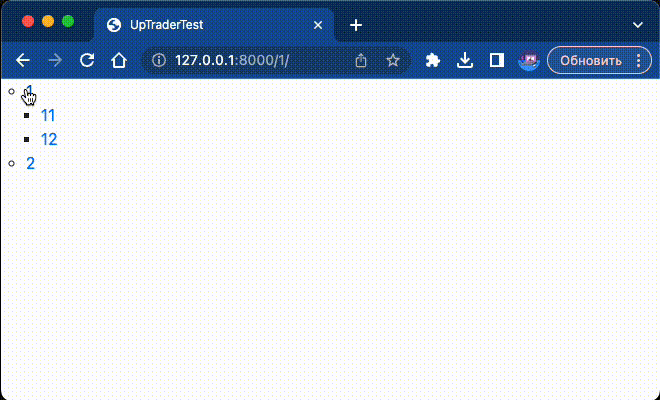

# UpTrader Test Task

<details>
<summary>Project stack</summary>

- Python 3.11
- Django 5.0

</details>

### Описание:

Тестовое задание в компанию UpTrader

### Задание:
Нужно сделать django app, который будет реализовывать древовидное меню, соблюдая следующие условия:
1) Меню реализовано через template tag
2) Все, что над выделенным пунктом - развернуто. Первый уровень вложенности под выделенным пунктом тоже развернут.
3) Хранится в БД.
4) Редактируется в стандартной админке Django
5) Активный пункт меню определяется исходя из URL текущей страницы
6) Меню на одной странице может быть несколько. Они определяются по названию.
7) При клике на меню происходит переход по заданному в нем URL. URL может быть задан как явным образом, так и через named url.
8) На отрисовку каждого меню требуется ровно 1 запрос к БД
 Нужен django-app, который позволяет вносить в БД меню (одно или несколько) через админку, и нарисовать на любой нужной странице меню по названию.
 ``
 При выполнении задания из библиотек следует использовать только Django и стандартную библиотеку Python.

### Пример работы:

<details>
<summary>База данных из примера:</summary>

| id | name | level | parent_id |
|----|------|-------|-----------|
| 1  | 1    | 0     |           |
| 2  | 11   | 1     | 1         |
| 5  | 111  | 2     | 2         |
| 7  | 1111 | 3     | 5         |
| 6  | 112  | 2     | 2         |
| 3  | 12   | 1     | 1         |
| 4  | 2    | 0     |           |
| 8  | 21   | 1     | 4         |
| 9  | 211  | 2     | 8         |
| 10 | 212  | 2     | 8         |
| 11 | 2121 | 3     | 10        |
| 12 | 2122 | 3     | 10        |
| 13 | 213  | 2     | 8         |
| 14 | 214  | 2     | 8         |
| 15 | 215  | 2     | 8         |
| 16 | 22   | 1     | 4         |
| 17 | 23   | 1     | 4         |
| 18 | 24   | 1     | 4         |

</details>

### Инструкция по запуску:
Клонируйте репозиторий:
```bash
git clone git@github.com:ThatCoderMan/UpTraderTest.git
```
Установите и активируйте виртуальное окружение:

- *для MacOS:*
    ```bash
    python3 -m venv venv
    ```
- *для Windows:*
    ```bash
    python -m venv venv
    source venv/bin/activate
    source venv/Scripts/activate
    ```
Установите зависимости из файла requirements.txt:
```bash
pip install -r requirements.txt
```
Перейдите в папку с проектом:
```bash
cd src
```
Примените миграции:
```bash
python manage.py migrate
```
В папке с файлом manage.py выполните команду для запуска сервера:
```bash
python manage.py runserver
```

### Автор проекта:

[Artemii Berezin](https://github.com/ThatCoderMan)
